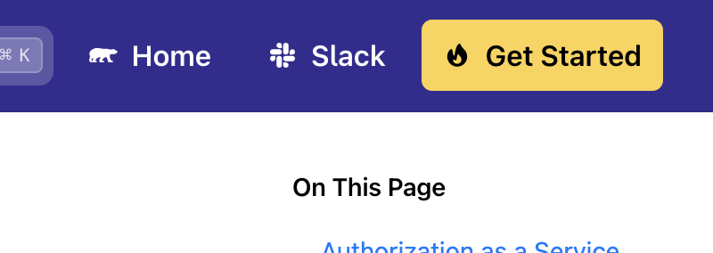

# Oso's Nextra Theme

This fork slightly customizes the `nextra-theme-docs` theme to enable custom
features for Oso's docs site.

This fork makes only tiny changes to [the `nextra` origin](https://github.com/shuding/nextra/tree/core):

- It adds the ability to have "sidebar sections" by including an `isSection` option in `_meta.json`:
  ```js
  // in _meta.json
  "get-started": {
    "title": "Get Started",
    "isSection": true // this gives this element `section` class in the sidebar
  },
  // ...
  ```
  
- It adds the ability to insert custom header content (which we use for inserting links):
  

**Note**: the custom header content change will no longer be needed once this upstream PR lands (it does the same thing): https://github.com/shuding/nextra/pull/907

**Ideally in the future Nextra is suitably customizable that we don't need this
repo at all. We should try to make as few changes as possible to make merging
upstream changes easier.**

## Development

How to use this for local development of the Oso Cloud Docs:

First, install [`pnpm`](https://pnpm.io/installation) if you haven't already:

```
curl -fsSL https://get.pnpm.io/install.sh | sh -
```

Then, in this repository, run:

```sh
# Install requirements for running this monorepo
pnpm i

cd packages/nextra-theme-docs
pnpm i
# This will watch for changes
pnpm dev
```

In the Oso Cloud Docs folder, run:

```
npm run local-theme
```

Then, you should be able to make changes to `packages/nextra-theme-docs` and see
those changes reflected in the Oso Cloud Docs.

## Publishing

When it comes time to publish your changes to `nextra-theme-docs-oso`, just run
`npm publish` (TODO: this should be automated eventually if we're often making
changes to this repo):

```sh
cd packages/nextra-theme-docs
npm publish
```

## Pulling in changes from upstream

If you haven't already, add the upstream origin:
```
git remote add upstream git@github.com:shuding/nextra.git
```

Fetch and merge the `core` branch:
```
git fetch upstream core
git merge upstream/core
```

**Note**: Merging is probably preferable to rebasing -- you'll have a bad time re-applying all the commits.

### Resolving merge conflicts

This should be pretty straightforward, as all oso-specific changes are marked with a comment:
```js
// Example from sidebar.tsx
className={cn(
  'gap-2 items-center justify-between',
  classes.link,
  active ? classes.active : classes.inactive,
  // BEGIN OSO-SPECIFIC CODE: add a section class
  isSection ? 'section' : ''
  // END OSO-SPECIFIC CODE
)}
```

There can be times when files have entirely moved. These are trickier things to
merge, but it's helpful to remember that we only have to maintain the few
changes in this fork. Otherwise, the code should be exactly the same.

NOTE: Original README.md below this line.

-------

# Nextra

Simple, powerful and flexible site generation framework with everything you love from Next.js.

## Documentation

[https://nextra.site](https://nextra.site)

## Development

### Installation

The Nextra repository uses [PNPM Workspaces](https://pnpm.io/workspaces) and [Turborepo](https://github.com/vercel/turborepo). To install dependencies, just simply run `pnpm` in the project root directory.

### Build Nextra Core

```bash
cd packages/nextra
pnpm build
```

Watch mode: `pnpm dev`

### Build Nextra Theme

```bash
cd packages/nextra-theme-docs
pnpm build
```

| Command           | Description              |
| ----------------- | ------------------------ |
| pnpm dev          | Watch mode               |
| pnpm dev:layout   | Watch mode (layout only) |
| pnpm dev:tailwind | Watch mode (style only)  |

### Development

You can also debug them together with a website locally. For instance, to start examples/docs locally, run

```bash
cd examples/docs
pnpm dev
```

Any change to example/docs will be re-rendered instantly.

If you update the core or theme packages, a rebuild is required. Or you can use the watch mode for both nextra and the theme in separated terminals.
